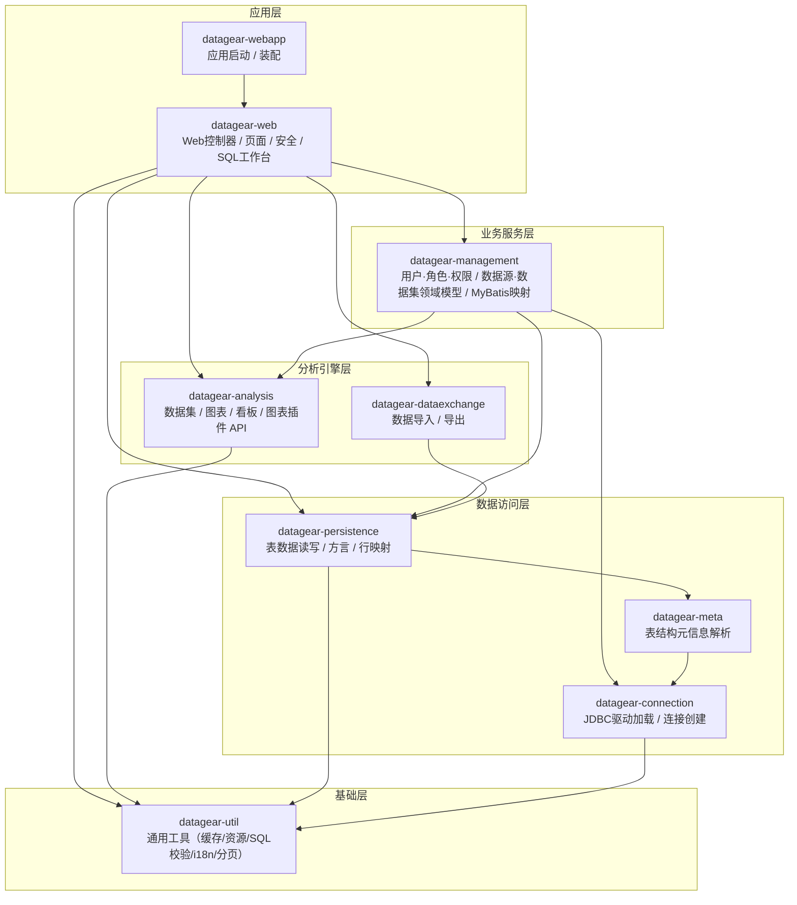
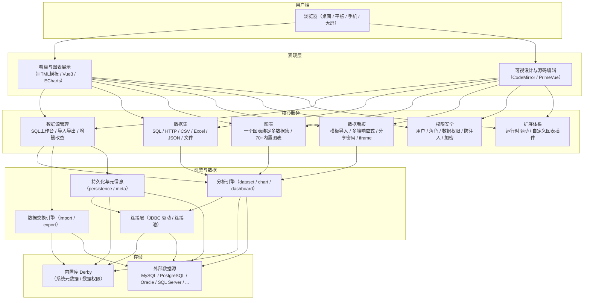
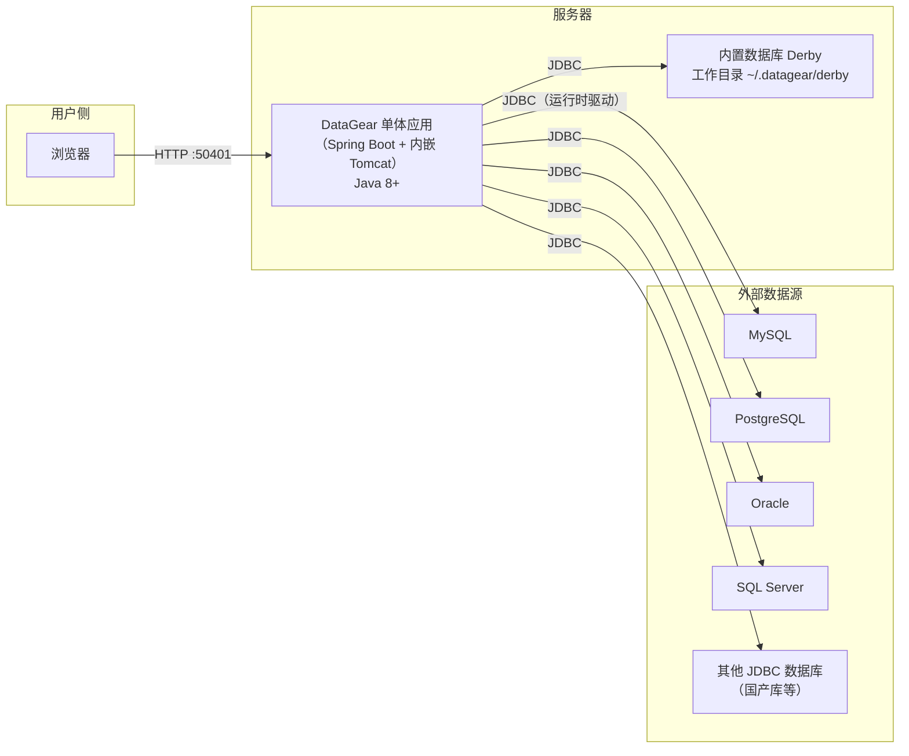
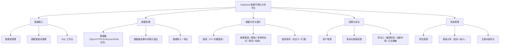

<p align="center">
	<a href="http://www.datagear.tech"></a>
</p>
<h1 align="center">
	数据可视化分析平台
</h1>
<h2 align="center">
	自由制作任何数据看板
</h2>

# 简介

DataGear是一款开源免费的数据可视化分析平台，自由制作任何数据看板，支持接入SQL、CSV、Excel、HTTP接口、JSON等多种数据源。

系统主要功能包括：数据源管理、SQL工作台、数据导入/导出、项目管理、数据集管理、图表管理、看板管理、用户管理、角色管理、数据源驱动管理、图表插件管理等。

## [DataGear 6.0.0 已发布，欢迎官网下载使用！](http://www.datagear.tech)

## [DataGear企业版 1.5.0 正式发布，欢迎试用！](http://www.datagear.tech/pro/)

# 特点

- 安全稳定
<br>
数年持续开发迭代，稳定运行数千小时无异常，功能流畅不卡顿
<br>
私有化部署，单体应用，轻量架构，安装简单，运行环境和数据全掌控
<br>
基于角色的权限控制策略，数据默认私有，可分享共用，保护数据安全
<br>
越权访问校验、SQL防注入、数据源防护、敏感信息加密存储、日志脱敏处理

- 功能丰富
<br>
数据源管理支持数据增删改查、导入导出、SQL工作台
<br>
数据集支持SQL/HTTP/CSV/Excel/JSON/文件，支持定义参数和参数化语法
<br>
图表支持在一个内绑定多个不同来源的数据集，内置70+开箱即用的常用图表
<br>
数据看板支持导入HTML模板、可视/源码编辑模式、手机/平板/桌面/大屏多端响应式布局、分享密码、iframe嵌入
<br>
用户管理、角色管理、数据源驱动管理、图表插件管理等功能

- 易于扩展
<br>
支持运行时添加数据源驱动，接入任何提供JDBC驱动库的数据库，包括但不限于MySQL、PostgreSQL、Oracle、SQL Server、Elasticsearch、ClickHouse， 以及OceanBase、TiDB、人大金仓、达梦等众多国产数据库
<br>
支持编写和上传自定义图表插件，扩展系统图表类型，也支持重写和扩展内置图表插件、自定义图表选项，个性化图表展示效果

- 自由制作
<br>
数据看板采用原生的HTML网页作为模板，支持导入任意HTML/JavaScript/CSS，支持可视化设计，同时支持自由编辑源码
<br>
支持引入Vue、React、Bootstrap、Tailwind CSS等web前端框架，制作具有丰富交互效果、多端适配的数据看板
<br>
内置丰富的数据看板API，可制作图表联动、数据钻取、异步加载、交互表单等个性化数据看板

# 功能


# 官网

[http://www.datagear.tech](http://www.datagear.tech)

# 界面

数据源管理


SQL数据集


看板编辑


看板展示


看板展示-图表联动


看板展示-实时图表


看板展示-钻取


看板展示-表单


看板展示-联动异步加载图表


# 技术栈（前后端一体）

- 后端
  <br>
  Spring Boot、Mybatis、Freemarker、Derby、Jackson、Caffeine、Spring Security

- 前端
  <br>
  jQuery、Vue3、PrimeVue、CodeMirror、ECharts、DataTables

# 模块介绍

- datagear-analysis
  <br>数据分析底层模块，定义数据集、图表、看板API

- datagear-connection
  <br>数据库连接支持模块，定义可从指定目录加载JDBC驱动、新建连接的API

- datagear-dataexchange
  <br>数据导入/导出底层模块，定义导入/导出指定数据源数据的API

- datagear-management
  <br>系统业务服务模块，定义数据源、数据分析等功能的服务层API

- datagear-meta
  <br>数据源元信息底层模块，定义解析指定数据源表结构的API

- datagear-persistence
  <br>数据源数据管理底层模块，定义读取、编辑、查询数据源表数据的API

- datagear-util
  <br>系统常用工具集模块

- datagear-web
  <br>系统web模块，定义web控制器、操作页面

- datagear-webapp
  <br>系统web应用模块，定义程序启动类

# 依赖

	Java 8+
	Servlet 3.1+

# 编译

## 准备单元测试环境

1. 安装`MySQL-8.0`数据库，并将`root`用户的密码设置为：`root`（或者修改`test/config/test.properties`配置）

2. 新建测试数据库，名称取为：`dg_test`

3. 使用`test/sql/test-mysql.sql`脚本初始化`dg_test`库

## 执行编译命令

	mvn clean package

或者，也可不准备单元测试环境，直接执行如下编译命令：

	mvn clean package -DskipTests

编译完成后，将在`datagear-webapp/target/datagear-[version]-packages/`内生成程序包。

# 调试
1. 将`datagear`以maven工程导入至IDE工具
2. 以调试模式运行`datagear-webapp`模块的启动类`org.datagear.webapp.DataGearApplication`
3. 打开浏览器，输入：`http://localhost:50401`
## 调试注意
在调试开发分支前（`dev-*`），建议先备份DataGear工作目录（`[用户主目录]/.datagear`），
因为开发分支程序启动时会修改DataGear工作目录，可能会导致先前使用的正式版程序、以及后续发布的正式版程序无法正常启动。

系统启动时会根据当前版本号自动升级内置数据库（Derby数据库，位于`[用户主目录]/.datagear/derby`目录下），且成功后下次启动时不再自动执行，如果调试时遇到数据库异常，需要查看

	datagear-management/src/main/resources/org/datagear/management/ddl/datagear.sql

文件，从中查找需要更新的SQL语句，手动执行。

然后，手动执行下面更新系统版本号的SQL语句：

	UPDATE DATAGEAR_VERSION SET VERSION_VALUE='当前版本号'
	
例如，对于`4.6.0`版本，应执行：

	UPDATE DATAGEAR_VERSION SET VERSION_VALUE='4.6.0'

系统自带了一个可用于为内置数据库执行SQL语句的简单工具类`org.datagear.web.util.DerbySqlClient`，可以在IDE中直接运行。注意：运行前需要先停止DataGear程序。

# 版权和许可

Copyright 2018-2026 datagear.tech

DataGear is free software: you can redistribute it and/or modify it under the terms of
the GNU Lesser General Public License as published by the Free Software Foundation,
either version 3 of the License, or (at your option) any later version.

DataGear is distributed in the hope that it will be useful, but WITHOUT ANY WARRANTY;
without even the implied warranty of MERCHANTABILITY or FITNESS FOR A PARTICULAR PURPOSE.
See the GNU Lesser General Public License for more details.

You should have received a copy of the GNU Lesser General Public License along with DataGear.
If not, see <https://www.gnu.org/licenses/>.

---

# 代码结构解读

> 本部分为 DataGear 源码的详细解读，包括项目内容与功能说明、模块分层依赖、以及代码架构图、产品架构图、部署架构图、功能架构图四张架构图。

## 一、项目概览

DataGear 是一款**开源免费的数据可视化分析平台**，采用 **Java 单体应用**架构，前后端一体，私有化部署，可接入 SQL、CSV、Excel、HTTP 接口、JSON 等多种数据源，自由制作任意数据看板。

- 版本：`6.0.0`
- 构建工具：Maven（多模块工程）
- 后端技术栈：Spring Boot 2.7.18、MyBatis 3.3.1、Freemarker、Derby（内置库）、Jackson、Caffeine、Spring Security
- 前端技术栈：jQuery、Vue3、PrimeVue、CodeMirror、ECharts、DataTables
- 运行环境：Java 8+、Servlet 3.1+

工程共 **9 个 Maven 模块**、约 **880 个 Java 源文件**：

| 模块 | 文件数 | 定位 | 核心职责 |
| --- | --- | --- | --- |
| datagear-util | 117 | 基础层 | 通用工具集（缓存、资源、SQL 校验、i18n、分页查询、版本等） |
| datagear-connection | 47 | 数据连接层 | JDBC 驱动加载、数据库连接创建 |
| datagear-meta | 30 | 数据连接层 | 解析数据源元信息（表结构、主键、外键、列、数据类型） |
| datagear-persistence | 59 | 数据访问层 | 读取/编辑/查询数据源表数据（方言、行映射、分页） |
| datagear-dataexchange | 91 | 分析引擎层 | 数据导入/导出（CSV/Excel/JSON/SQL） |
| datagear-analysis | 242 | 分析引擎层 | 数据分析底层 API（数据集、图表、看板、图表插件） |
| datagear-management | 117 | 业务服务层 | 系统业务服务（用户/角色/权限/数据源/数据集等领域模型与 MyBatis 映射） |
| datagear-web | 166 | 表现层 | Web 控制器、页面、安全、SQL 工作台 |
| datagear-webapp | 11 | 应用层 | 程序启动类与装配配置 |

## 二、模块分层依赖

`datagear-util` 是唯一无内部依赖的底层模块，其余模块自底向上逐层依赖，最终由 `datagear-webapp` 装配成单体应用：

```
datagear-webapp
      └──> datagear-web  ──> datagear-management ──> datagear-analysis
              │                    │                        └──> datagear-util
              │                    ├──> datagear-persistence ─┐
              │                    └──> datagear-connection   │
              ├──> datagear-dataexchange ──> datagear-persistence
              ├──> datagear-persistence
              └──> datagear-util

datagear-persistence ──> datagear-meta ──> datagear-connection
datagear-meta ──> datagear-connection ──> datagear-util
```

## 三、代码架构图（模块分层与依赖）



## 四、产品架构图



## 五、部署架构图（私有化单体部署）



## 六、功能架构图



## 七、核心模块职责说明

### 1. datagear-util —— 通用工具集（基础层）

不依赖任何内部模块，为上层提供基础设施能力：

- `cache/`：缓存抽象（`CacheAware`、`CollectionCacheValue`、`CommonCacheKey`）
- `resource/`：资源与连接工厂（`ResourceFactory`、`ConnectionFactory`、`DataSourceConnectionFactory`、文件/类路径读写工厂）
- `sqlvalidator/`：SQL 校验（`AbstractSqlValidator`、`InvalidPatternSqlValidator`、`SqlTokenParser`、`DatabaseProfile`）
- `query/`：分页与查询参数模型（`Order`、`Paging`、`PagingData`、`KeywordQuery`）
- `html/`：HTML 过滤（`HtmlFilter`、`FilterHandler`）
- `i18n/`：国际化标签（`Label`、`Labeled`、`LabelUtil`、`Localizable`）
- `spel/`：Spring EL 表达式解析（`BaseSpelExpressionParser`、`MapAccessor`）
- `dirquery/`：目录分页查询、`version/`：版本与更新日志、`expression/`：表达式求值
- 顶层工具：`Global`（全局常量/产品版本）、`IOUtil`、`FileUtil`、`StringUtil`、`JdbcUtil`、`Sql`、`SqlScriptParser`、`NumberParser`、`AsteriskPatternMatcher`、`Revision/IDUtil` 等

### 2. datagear-connection —— 数据库连接支持

提供「从指定目录加载 JDBC 驱动」和「创建数据库连接」的能力：

- 驱动管理：`DriverEntity`、`DriverEntityManager`、`XmlDriverEntityManager`、`PathDriverFactory`、`PathClassLoader`、`DriverChecker`、`SimpleDriverChecker`
- 连接管理：`ConnectionSource`、`DefaultConnectionSource`、`ConnectionOption`
- URL 探测：`URLSensor`、`URLConnectionSensor`、`PrefixURLSensor`、`ConstantURLSensor` 及各数据库实现（`MySqlURLSensor`、`OracleURLSensor`、`PostgresqlURLSensor`、`SqlServerURLSensor`、`DerbyURLSensor`）
- 连接属性处理：`PropertiesProcessor`、`GenericPropertiesProcessor`、`DevotedPropertiesProcessor`

### 3. datagear-meta —— 数据源元信息解析

解析指定数据源的表结构：

- 解析器：`DBMetaResolver`、`GenericDBMetaResolver`、`DevotedDBMetaResolver`、`AbstractDevotedDBMetaResolver`、`WildcardDevotedDBMetaResolver`
- 元模型：`Database`、`Table`、`SimpleTable`、`AbstractTable`、`Column`、`PrimaryKey`、`ImportKey`、`UniqueKey`、`DataType`、`TableType`、`TableUtil`
- 表类型解析：`TableTypeResolver`、`DefaultTableTypeResolver`、`DbTableTypeSpec`；调试工具 `DatabaseMetaDataPrinter`

### 4. datagear-persistence —— 数据源表数据读写

管理数据源表数据的读取、编辑、查询：

- 方言：`Dialect`、`AbstractDialect`、`DialectBuilder`、`DialectSource`（屏蔽不同数据库 SQL 差异）
- 核心：`PersistenceManager`（数据增删改查入口）、`Query`、`PagingQuery`
- 行映射：`Row`、`RowMapper`、`AbstractRowMapper`、`SqlParamValueMapper`、`LiteralSqlParamValue`

### 5. datagear-dataexchange —— 数据导入/导出

- 服务：`DataExchangeService`、`DataExchange`、`BatchDataExchange`、`SimpleBatchDataExchange`、`BatchDataExchangeResult`、`FormatDataExchange`、`SubDataExchange`
- 查询：`Query`、`AbstractQuery`、`SqlQuery`、`TableQuery`、`TextDataExport`、`QueryTextDataExport`、`TextValueDataImport`
- 格式实现（`support/`）：`CsvDataImport/Export`、`ExcelDataImport/Export`、`JsonDataImport/Export`、`SqlDataImport/Export`
- 索引与监听：`DataIndex`、`RowDataIndex`、`RowColumnDataIndex`、各类 `*Listener`

### 6. datagear-analysis —— 数据分析底层 API

- 数据集：`DataSet`、`AbstractDataSet`、`DataSetField`、`DataSetParam`、`DataSetQuery`、`DataSetResult`、`ResolvableDataSet`、`ResolvedDataSetResult`、`DataSetBind`
- 数据集实现（`support/`）：`SqlDataSet`、`HttpDataSet`、`JsonValueDataSet`、`JsonFileDataSet`、`CsvValueDataSet`、`CsvFileDataSet`、`CsvDirectoryFileDataSet`、`ExcelDataSet` 及 JSON 路径支持 `JsonPathSupport`
- 图表：`Chart`、`ChartDefinition`、`ChartPlugin`、`ChartPluginManager`、`ChartQuery`、`ChartResult`、`ChartTheme`、`ChartWidget`、`ChartWidgetSource`
- 图表插件（`support/html/`）：`HtmlChart`、`HtmlChartPlugin`、`HtmlChartWidget`、`JsChartRenderer`
- 看板：`Dashboard`、`DashboardQuery`、`DashboardResult`、`DashboardQueryHandler`、`DashboardTheme`、`TplDashboard`、`RenderContext`、`DefaultRenderContext`
- 表单与校验：`Form`、`FormProperty`、`InputFormProperty`、约束 `Constraint`（`Required`、`Max`、`Min`、`MaxLength`、`MinLength`）

### 7. datagear-management —— 系统业务服务层

- 领域模型（`domain/`）：`User`、`Role`、`Authorization`、`AnalysisProject`、`DataSetEntity`、`SqlDataSetEntity`、`CsvFileDataSetEntity`、`ExcelDataSetEntity`、`JsonFileDataSetEntity`、`JsonValueDataSetEntity`、`HttpDataSetEntity`、`DtbsSource`、`DtbsSourceGuard`、`FileSource`、`DashboardShareSet`、`SqlHistory` 等
- 服务接口与实现（`service/`、`service/impl/`）：`UserService`、`RoleService`、`DataSetEntityService`、`DtbsSourceService`、`AuthorizationService`、`AnalysisProjectService`、`FileSourceService` 等
- 数据库版本管理：`dbversion/DbVersionManager`
- MyBatis 映射（`resources/mapper/`）与建表脚本（`resources/ddl/datagear.sql`）
- 工具（`util/`）：`DataPermissionSpec`、`DtbsSourceGuardChecker`、方言构建器（`dialect/`）、类型处理器（`typehandlers/`）

### 8. datagear-web —— Web 表现层

- 控制器（`controller/`）：40 余个，如 `UserController`、`RoleController`、`DataSetController`、`ChartController`、`DashboardController`、`DtbsSourceController`、`AnalysisProjectController`、`AuthorizationController`、`LoginController`、`RegisterController`、`SqlpadController` 等
- 配置（`config/`）：`SecurityConfigSupport`、`CoreConfigSupport`、`DataSourceConfigSupport`、`SchedulingConfigSupport`、`WebMvcConfigurerConfigSupport` 等
- 安全（`security/`）：`AuthUser`、`UserDetailsServiceImpl`、认证成功/失败处理器、登录锁定（`LoginLatchFilter`）
- SQL 工作台（`sqlpad/`）：`SqlpadExecutionService`、`SqlpadExecutionSubmit`
- 其它：`freemarker/`（自定义视图）、`json/jackson/`（序列化扩展）、`format/`（日期格式化）、`accesslatch/`（访问限流）等

### 9. datagear-webapp —— 应用启动层

- 启动类：`DataGearApplication`（Spring Boot main）、`DataGearServletInitializer`（外置 WAR）
- 装配配置：`CoreConfig`、`DataSourceConfig`、`SecurityConfig`、`SchedulingConfig`、`ServletConfig`、`TransactionConfig`、`WebMvcConfigurerConfig`、`WebMvcRegistrationsConfig`、`ApplicationPropertiesConfig`
