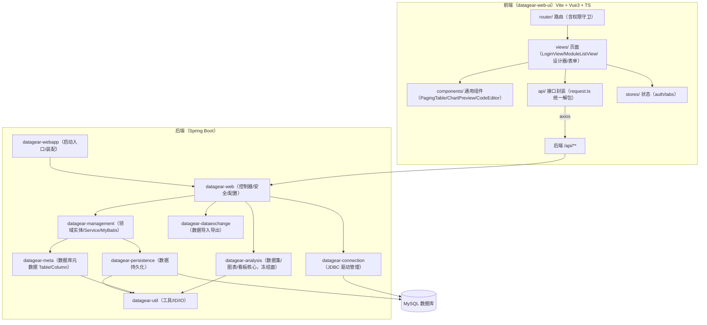
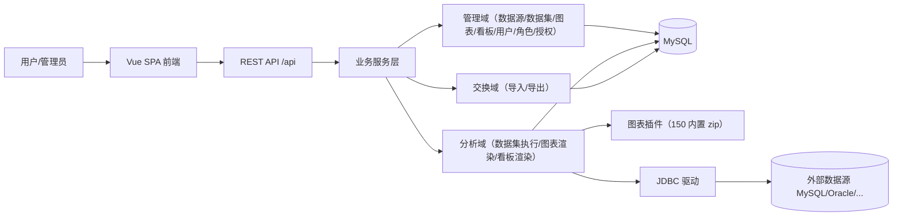
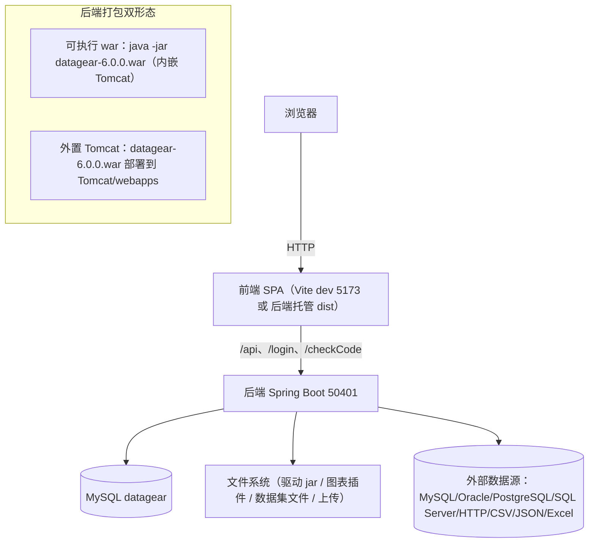
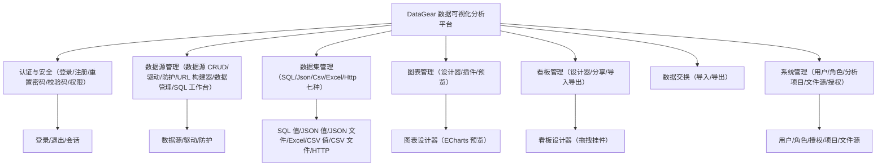

# DataGear 前后端分离改造项目 · 代码解读与架构说明

> 本文件是「DataGear 前端 Vue 化前后端分离改造」的代码解读文档，包含项目内容、功能说明、
> 四类架构图（代码/产品/部署/功能），以及各模块、类、方法的详细说明。
> 配合《软件使用说明书》与《前后端请求响应流程》使用。

---

## 一、项目概述

DataGear 原是一个基于 **Spring Boot + FreeMarker + jQuery/po 框架** 的单体 Web 应用。
本次改造将其前端整体迁移为 **Vue 3 单页应用（SPA）**，后端收敛为 **REST `/api` 接口**，
并**彻底移除 FreeMarker 视图体系与 iframe 依赖**，实现真正的前后端分离。

**改造前 → 改造后对比**

| 维度 | 改造前 | 改造后 |
|---|---|---|
| 前端 | FreeMarker 模板(.ftl) + jQuery + po 框架 | Vue 3 + Vite + TS + Pinia + PrimeVue |
| 后端视图 | 控制器返回 `.ftl` 视图名 | 控制器返回 JSON（`OperationMessage<T>`） |
| 图表/看板渲染 | iframe 嵌入 `/cv`、`/dv` | Vue ECharts 原生渲染（`ChartPreview.vue`） |
| 部署 | 单体 FreeMarker 应用 | 前端可独立部署 / 后端可单端口托管 SPA |

---

## 二、架构图

### 2.1 代码架构图（模块依赖）



### 2.2 产品架构图



### 2.3 部署架构图



### 2.4 功能架构图



---

## 三、代码结构详解（模块 → 类 → 方法）

### 3.1 后端模块

#### `datagear-webapp`（启动装配）
- `DataGearApplication`：Spring Boot 入口，`@SpringBootApplication(exclude=FreeMarkerAutoConfiguration/ErrorMvcAutoConfiguration/MultipartAutoConfiguration)`，禁用 DevTools Restart，设置应用 Banner。

#### `datagear-web`（Web 控制器/安全/配置）——本次改造核心
- `controller/AbstractController`：所有控制器基类，提供 `getCurrentUser()`、`getMessage()`、`optSuccessResponseEntity()` 等通用工具；`getErrorView()` 直接输出 JSON 错误（脱离 error.ftl）。
- `controller/AbstractEntityApiController<T>`：通用 CRUD API 基类，`GET /api/{m}/get/{id}`、`POST /api/{m}/save`（按 id 判增改）、`POST /api/{m}/delete`；钩子 `getEntityForEdit/persistEntity/prepareSaveEntity/checkSaveEntity/toFormResponseData`。
- `controller/AbstractDataPermissionApiController<T>`：数据权限实体基类，覆盖分页（`pagingQuery(user,query)`）、`getEntityForEdit`（权限校验）、`persistEntity`（自动 `inflateCreateUserAndTime` + `add/update(user,entity)`）。
- `controller/{Role,User}ApiController`：角色/用户 CRUD；User 覆盖 `save`（用户名唯一校验/密码清空/管理员锁定）与 `delete`（业务数据迁移）。
- `controller/{AnalysisProject,FileSource,DtbsSource,Dashboard,DataSet,Chart}ApiController`：数据权限模块 CRUD。
- `controller/ChartApiController`：`get/{id}`、`saveEdit`、`preview/{id}`（执行图表数据返回列+行，供 ECharts 渲染）。
- `controller/DashboardApiController`：`get/{id}`、`shareSet`、保存（新增默认模板/编辑保留模板）。
- `controller/{DriverEntity,ChartPlugin,Authorization,DtbsSourceUrlBuilder,Public}ApiController`：驱动/插件/授权/URL 构建器/公共只读。
- `controller/ErrorController`：`/error` 统一 JSON/HTML 错误输出（脱离 error.ftl）。
- `controller/ResetPasswordController`：新增 `init`/`step` JSON 端点，原 `fillUserInfo/checkUserInfo/setNewPassword` 三步。
- `config/SecurityConfigSupport`：`/api/**` 按模块授权、`/api/about` 等 permitAll。
- `config/WebMvcConfigurerConfigSupport`：已移除 FreeMarker 视图解析器，新增 `/index.html`、`/assets/**` SPA 资源映射。
- `util/OperationMessage<T>`：统一响应体（`type/code/message/data`）。

#### `datagear-management`（领域实体/服务）
- `domain/`：`User/Role/DtbsSource/DataSetEntity(接口)/HtmlChartWidgetEntity/HtmlTplDashboardWidgetEntity/Authorization/DashboardShareSet/FileSource/AnalysisProject` 等实体。
- `service/EntityService`、`DataPermissionEntityService`：基础 CRUD 与数据权限服务接口。
- `service/impl/`：MyBatis 实现，`AbstractMybatisEntityService`、`AbstractMybatisDataPermissionEntityService`。

#### `datagear-analysis`（分析核心，冻结面，勿改）
- `DataSet`/`DataSetBind`/`ChartDefinition`/`ChartResult`/`DataSetResult`：数据集/图表绑定/图表定义/执行结果模型。
- `support/ChartWidget`、`HtmlTplDashboardWidget`、`HtmlChartPlugin`：图表挂件/看板/图表插件。
- `support/datasettpl/`：数据集模板语言（FreeMarker 方言，冻结保留）。

#### `datagear-connection`（JDBC 驱动）
- `DriverEntity`、`DriverEntityManager`：数据库驱动元数据与文件管理。

#### `datagear-meta` / `datagear-persistence` / `datagear-dataexchange` / `datagear-util`
- `meta`：`Table/Column/PrimaryKey` 数据库元数据。
- `persistence`：`PersistenceManager`（查询/增删改执行器）。
- `dataexchange`：导入/导出（CSV/JSON/Excel/SQL）。
- `util`：`IDUtil`（ID 生成）、`IOUtil`、`Global`（版本常量）等。

### 3.2 前端模块（`datagear-web-ui`）

```
src/
├── api/              # 后端接口封装（request.ts 统一解包 OperationMessage）
│   ├── auth.ts       # 登录/当前用户/注册
│   ├── paging.ts     # 通用分页 loader
│   ├── crud.ts       # 通用 moduleGet/moduleSave/moduleDelete
│   ├── role.ts/user.ts/dashboard.ts/chart.ts/...  # 各模块 API
├── components/       # 通用组件
│   ├── PagingTable.vue    # 通用分页表格（列/排序/行操作）
│   ├── ChartPreview.vue   # ECharts 通用图表渲染（脱离 iframe）
│   ├── CodeEditor.vue     # CodeMirror 代码编辑器
├── views/            # 页面
│   ├── LoginView/RegisterView/ResetPasswordView/AboutView/ChangelogView
│   ├── ModuleListView.vue  # 通用模块列表页
│   ├── role/user/analysisProject/fileSource/dtbsSource/dashboard/... # 各表单/列表
│   ├── chart/ChartDesignerView.vue      # 图表设计器
│   ├── dashboard/DashboardDesignerView.vue # 看板设计器
│   ├── sqlpad/SqlpadEditor.vue          # SQL 工作台
│   ├── exchange/...                     # 数据导入导出
├── stores/           # Pinia（auth/tabs）
├── router/index.ts   # 路由（登录守卫 + SPA 回落）
├── types/            # TS 类型（OperationMessage/PagingData/...）
```

---

## 四、技术栈

- **前端**：Vue 3.2、Vite 4.5、TypeScript 5、Pinia 2、PrimeVue 3.34、vue-router 4、vue-i18n、axios、CodeMirror 5、sortablejs、ECharts 5（按需引入）。
- **后端**：Spring Boot 2.7.18、Spring Security、MyBatis、Java 8、MySQL。
- **打包**：Maven（frontend-maven-plugin，`-DskipFrontend=false` 触发前端构建）。

---

## 五、构建与部署

```bash
# 前端开发态
cd datagear-web-ui && npm install && npm run dev   # 5173 代理到 50401

# 后端开发态
mvn spring-boot:run -pl datagear-webapp -Dspring-boot.run.arguments="--disableLoginCheckCode=true"

# 生产打包（含前端构建，产物拷入 static/）
mvn package -DskipFrontend=false
java -jar datagear-webapp/target/datagear-6.0.0.war    # 单端口服务整个 SPA
```

---

## 六、关键约定与冻结面（勿删）

- **统一响应**：`OperationMessage<T>`（`type/code/message/data`），前端 `unwrap()` 解包。
- **双轨**：旧 `/xxx` 端点（裸返回）与新 `/api/xxx`（`OperationMessage<T>`）并存。
- **冻结面**：`/cv`、`/dv`、`/vres`、`/checkCode`、3 个 Compat 控制器、`datagear-analysis` 的 freemarker + `datasettpl`、`static/analysisapi`、`analysislib`、`builtInChartPlugins`。
- **注释规范**：Java 类/方法使用 Javadoc；前端组件使用 `//` 顶部说明。本次新增的 API 控制器与前端视图均已附带类级/方法级注释。
