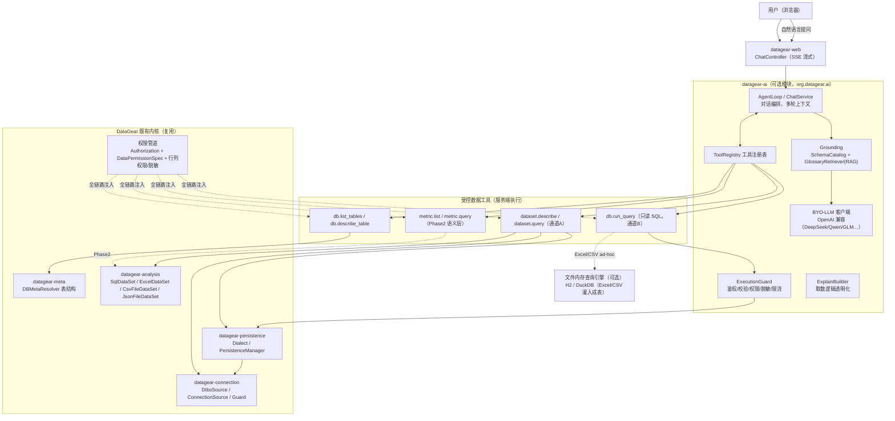

# DataGear 智能问数（ChatBI）技术实现方案

> 目标：让大模型（LLM）能够**安全地访问 MySQL 等数据库、以及 Excel / CSV / JSON 等文件**，回答用户的自然语言提问（智能问数）。
> 基线：DataGear 6.0.0（Java 8 / Spring Boot 2.7 / Maven 多模块）。
> 本文与仓库内 `docs/productdesign/PRD-BI产品需求文档-V4.1-优化版.docx` 与 `docs/productdesign/sds/SDS-软件开发说明书-V1.0.md` 配套：后者给出产品需求与「语义层 + Text2DSL」的完整蓝图，本文聚焦**「大模型如何安全触达异构数据源」这一工程实现细节**，两者可合并落地。

---

## 0. 结论速览（TL;DR）

1. **不要让大模型「裸跑 SQL」碰数据，而是给大模型一组受控的「数据工具（Tools）」，由系统在服务端安全执行。** 大模型只负责「理解问题 + 决定调用哪个工具 + 组装查询参数」，真正的取数由 DataGear 已有的连接层/元信息/数据集/方言体系确定性执行。
2. **两条取数通道并存、按成熟度递进：**
   - **通道 A（推荐主路径，对齐 SDS）**：大模型把问题映射到**已有数据集 / 指标（语义层）**，走 `DataSet.getResult(DataSetQuery)` 或指标查询引擎，天然继承权限、防注入、可解释。
   - **通道 B（直连数据源，本方案新增重点）**：对 MySQL 做「Schema grounding + 只读 SQL + 严格校验 + 沙箱执行」；对 Excel/CSV/JSON 文件做「文件 → 内存表 → SQL/聚合」或直接复用数据集。
3. **新增可选模块 `datagear-ai`**，核心包零 LLM 依赖，未配置模型时整体隐藏，保证开源内核可独立运行（对齐 NFR-AI-02）。
4. **安全第一**：所有工具强制走「鉴权 → 数据源防护 → SQL 校验 → 行/列权限 → 脱敏 → 行数/超时限制 → 只读 → 审计」，大模型只能看到「schema/术语/DSL/结果摘要」，看不到越权的明细。

---

## 1. 现状盘点：DataGear 已有的「数据访问能力」（可直接复用）

智能问数不是从零开始，下面这些现成能力就是「让大模型访问 MySQL/Excel」的底座：

| 能力 | 现有实现（类/模块） | 在智能问数中的复用方式 |
| --- | --- | --- |
| 数据库连接 | `datagear-connection`：`ConnectionSource`/`DefaultConnectionSource`、`DriverEntity`（运行时加载 JDBC 驱动）、`DtbsSource`（url/user/password/schemaName/properties） | 由「数据源 ID」解析出只读连接 |
| 表结构元信息 | `datagear-meta`：`DBMetaResolver` → `Database`/`Table`/`Column`/`PrimaryKey`/`DataType` | 作为 SQL 生成的 Schema grounding |
| 表数据读写 | `datagear-persistence`：`Dialect`/`PersistenceManager`/`Query`/`PagingQuery`/`RowMapper` | 只读查询的分页/方言屏蔽 |
| SQL 数据集 | `datagear-analysis`：`SqlDataSet`（`ConnectionFactory` + `sql` + `SqlValidator`，Freemarker `${pc()}` 预编译防注入） | 通道 A 执行，天然防注入 |
| 文件数据集 | `ExcelDataSet`/`CsvFileDataSet`/`JsonFileDataSet`/`ExcelDirectoryFileDataSet`（POI/CSV/JSON-P），统一 `DataSetResult` | 通道 A 读 Excel/CSV/JSON |
| 文件导入导出 | `datagear-dataexchange`：`ExcelDataImport/Export`、`CsvDataImport/Export` | 文件落库/转内存表 |
| SQL 防注入 | `datagear-util`：`InvalidPatternSqlValidator`、`AbstractSqlValidator`、`SqlTokenParser`、`DatabaseProfile` | 通道 B 的 SQL 白名单校验 |
| 数据源防护 | `DtbsSourceGuard`/`DtbsSourceGuardChecker` | 阻断恶意 URL/连接属性 |
| 权限体系 | `Authorization`（资源×主体×权限四档）+ `DataPermissionSpec` + `commonDataPermissionSqls.xml`（DP_* 行过滤） | 全链路权限继承 |
| 会话/审计 | `AuthUser`、Spring Security、`SqlHistory` | 问数会话与审计复用 |

**关键点**：MySQL 与 Excel 在 DataGear 里已经被抽象为同一种「数据集（DataSet）」契约 —— 二者对外都是 `getResult(DataSetQuery) → DataSetResult{data, fields}`。因此「让大模型访问 MySQL 和 Excel」可以**统一走数据集通道**，这是性价比最高的实现。

---

## 2. 总体架构与关键决策

### 2.1 总体架构图



### 2.2 关键决策（ADR）

| 决策 | 选择 | 理由 |
| --- | --- | --- |
| 大模型与数据的关系 | **Agent + 工具调用（Tool/Function Calling）**，大模型不直连数据 | 安全可控、可审计、可权限化；对齐行业共识（FineChatBI Text2DSL、SQLBot 可插拔） |
| MySQL 取数 | 通道 A 走数据集优先；通道 B 只读 SQL + 强校验 + 沙箱 | 兼顾「可治理」与「灵活 ad-hoc」 |
| Excel/CSV/JSON 取数 | 通道 A 直接复用文件数据集（零新依赖）；需要 ad-hoc 聚合时灌入**纯 Java 的 H2** 内存表跑 SQL | Java 8 兼容、无 JNI 负担；DuckDB 更快但需更高 JDK（PRD 风险 R2/R3），作为可选项 POC |
| SQL 生成 | **绝不裸生成后直接执行**：schema+术语 grounding → 生成 → `InvalidPatternSqlValidator` 校验 → 方言/权限改写 → 只读执行 → 失败重试/澄清 | 防注入、防越权、可解释 |
| LLM 依赖 | 核心包零 LLM 依赖；`datagear-ai` 可选部署 | 开源内核可独立运行（NFR-AI-02） |
| 前端交互 | SSE 流式；三段式回答（结论+图表+表格）+ 取数逻辑折叠区 | 对齐 SDS 交互契约 |
| 文件聚合引擎 | V1 用 H2（内存）或复用数据集内存聚合；DuckDB 作为 POC 后置 | 成本低、Java 8 稳 |

---

## 3. 核心链路（一次提问的完整数据流）

```
用户提问（自然语言）
  → 1. 会话上下文装配（近 N 轮问题/DSL/澄清记录）
  → 2. Grounding：SchemaCatalog（可访问的表/数据集/字段 + 术语同义词）→ 最小化后注入提示词
  → 3. LLM 意图理解：输出「工具调用计划 JSON」（不是 SQL）
        { tool, arguments }
        例：{ tool:"db.describe_table", args:{schemaId, table} }
        例：{ tool:"dataset.query", args:{datasetId, params:{...}} }
  → 4. ToolRegistry 路由 + ExecutionGuard 校验（鉴权/防护/校验/权限/脱敏/行数超时）
  → 5. 服务端确定性执行（PreparedStatement / 数据集 / 内存表）
  → 6. 结果裁剪与脱敏后回传 LLM（只回 schema+结果摘要，不回越权明细）
  → 7. LLM 综合回答：结论 + 推荐图表 + 数据表 + 取数逻辑
  → 8. 透明化：QueryExplainBuilder 输出 {dataset/sql/dsl/permission/costMs}
  → 9. 多轮追问 / 澄清 / 转图表 / 反馈（写问数日志用于评测）
```

**提示词侧原则（NFR-AI-03 / NFR-SEC-10）**：送给大模型的只有「表结构 schema、字段术语/同义词、少量结果统计摘要」，**不送全量明细行、不送连接串/密码、不送敏感列原文**；明细只在服务端结果里按权限返回给用户。

---

## 4. 模块与组件设计（datagear-ai）

### 4.1 模块位置与依赖

- 新增 Maven 模块 `datagear-ai`，包名 `org.datagear.ai`。
- 依赖（内部）：`datagear-util`、`datagear-analysis`（复用 `DataSet`/`DataSetResult`）、`datagear-connection`、`datagear-management`（复用 `DtbsSource`/`Authorization`/`DataPermissionSpec` 服务）。
- 仅 `datagear-web` 依赖 `datagear-ai`，且用 `@ConditionalOnProperty` 或「是否配置 LLM」决定是否装配 → 未配置时入口整体隐藏。

### 4.2 组件与类设计

| 组件 | 类/包建议 | 职责 |
| --- | --- | --- |
| 问数会话 | `ai.chat.ChatController` / `ChatSessionManager` | 对话管理、多轮上下文、历史 |
| 编排 | `ai.agent.AgentLoop` | 单轮「理解→工具→执行→综合」循环；澄清/重试控制 |
| LLM 客户端 | `ai.llm.LlmClient`（OpenAI 兼容 HTTP）+ `PromptTemplateManager` | BYO-LLM 调用；提示词模板外置 |
| 工具注册表 | `ai.tools.ToolRegistry` / `Tool`（接口） | 工具注册与分发；统一 `ToolResult` |
| Schema 目录 | `ai.grounding.SchemaCatalog` | 聚合可访问表/数据集/字段 + 术语同义词，最小化裁剪 |
| 知识库检索 | `ai.kb.KnowledgeRetriever`（RAG） | 术语/同义词/业务规则/golden queries 召回（向量库可插拔，默认关键词） |
| 执行守卫 | `ai.exec.ExecutionGuard` | 鉴权→防护→SQL 校验→权限改写→脱敏→行数/超时限制 |
| 透明化 | `ai.explain.QueryExplainBuilder` | 生成取数逻辑（dataset/sql/dsl/permission/costMs/cacheHit） |
| 解读/归因 | `ai.insight.InsightService` / `AttributionService`（Phase2） | 图表一键解读、指标波动归因 |
| 模型配置 | `ai.config.LlmConfigManager` | BYO-LLM 配置、Key 加密存储、按功能点指定模型 |
| 权限过滤器 | `ai.security.AiPermissionFilter` | 送模型内容脱敏裁剪；越权拒绝 |

### 4.3 数据访问工具清单（大模型可调用的「能力面」）

#### 通道 A：数据集/语义层工具（首选、可治理）

| 工具 | 入参 | 出参 | 复用 |
| --- | --- | --- | --- |
| `dataset.list` | 关键词/项目 | 可访问数据集列表 | `DataSetEntityService` |
| `dataset.describe` | `datasetId` | 字段（名称/类型/标签）+ 样例 + 参数定义 | `DataSet` 元信息 |
| `dataset.query` | `datasetId` + 参数值 | `DataSetResult`（走权限管道） | `DataSet.getResult(DataSetQuery)` |
| `metric.list` / `metric.query` | 主题域/关键词；DSL | 指标目录 / 指标取数结果 | Phase2 语义层 `MetricQueryEngine` |

#### 通道 B：直连数据源工具（ad-hoc，本方案重点）

| 工具 | 入参 | 出参 | 安全约束 |
| --- | --- | --- | --- |
| `db.list_tables` | `schemaId`（数据源） | 有权限的表 + 注释 | `DBMetaResolver`，按 `DataPermissionSpec` 过滤 |
| `db.describe_table` | `schemaId` + `table` | 列（名/类型/注释/主键）+ 术语同义词 + 少量样例统计 | 只送 schema，不送明细 |
| `db.run_query` | `schemaId` + `sql`（只读 SELECT） | 结构化结果 + 字段 + 影响行数 | 只读连接 + `InvalidPatternSqlValidator` + 行/列权限 + 脱敏 + 行数上限 + 超时 |
| `file.list` | 目录/关键词 | 可访问文件数据集 | `FileSource`/`DSR_DIRECTORY` |
| `file.query_adhoc` | 上传文件/`fileSourceId` + 查询意图 | 灌入内存表后执行聚合结果 | H2 内存表 + 只读 SQL；行数/大小上限 |

> `db.run_query` 仅允许 `SELECT`（禁止 DDL/DML/多语句/写文件/调用危险函数），且需先经过 `ExecutionGuard` 的白名单 + 权限改写。这是「让大模型访问 MySQL」的安全落地形态。

---

## 5. 数据访问层设计（MySQL 与 Excel 的具体实现）

### 5.1 MySQL（及其他 JDBC 数据库）

```
LLM 生成 SELECT
  → ExecutionGuard：
      1) 鉴权：取当前 AuthUser → 校验该 schemaId 数据源可见且有读取权限
      2) 防护：DtbsSourceGuard 校验连接 URL/属性
      3) SQL 校验：InvalidPatternSqlValidator（非法关键字/危险函数，按权限档位）
      4) 权限改写：DataPermissionSpec + commonDataPermissionSqls.xml 注入 DP_* 行过滤；
         （Phase2）行列权限：SQL 解析器(AST) 追加 WHERE + SELECT 列裁剪 + 脱敏包装
      5) 执行：只读 Connection（setReadOnly）→ Dialect 分页 → 行数上限（如 ≤1000）+ 超时（如 ≤5s）
      6) 脱敏：敏感列按角色掩码后出域
  → 结果裁剪回传
```

实现要点：
- 复用 `SqlDataSet` 的 `ConnectionFactory` + `SqlValidator` + `${pc()}` 预编译；`db.run_query` 本质是「动态 SQL + 强校验」版的 `SqlDataSet`。
- 只读连接可用 `Connection.setReadOnly(true)` + 数据源级只读账号双保险；超时用 `Statement.setQueryTimeout`。
- 方言差异交由 `Dialect`（分页/标识符/函数），不自行拼接。

### 5.2 Excel / CSV / JSON 文件

两种实现，按需选择：

**（推荐）方式 1：复用现有文件数据集（零新引擎）**
- 直接对 `ExcelDataSet` / `CsvFileDataSet` / `JsonFileDataSet` 调 `getResult(DataSetQuery)`。
- 大模型通过 `dataset.describe`（拿到 sheetName/nameRow/字段）→ `dataset.query`（带参数）取数。
- 优点：复用权限/缓存/防注入，Excel 的 sheet 名、表头行、数据行表达式等已有配置直接可用（`AbstractExcelDataSet` 的 `sheetName/sheetIndex/nameRow/dataRowExp/dataColumnExp`）。

**方式 2（ad-hoc 增强）：文件 → 内存表 → SQL**
- 当用户上传一个临时 Excel/CSV 并想做「按某列分组求和/排序」这类聚合时，把文件读入**内存表**再执行生成 SQL。
- 引擎选型（Java 8 友好）：**H2（纯 Java，推荐 V1）**；**DuckDB（JNI，更快，需 POC 确认 JDK）**。
- 流程：`file.query_adhoc` → 用 POI/CSV 读入 → 自动推断列名/类型（表头行）→ 建临时表 → `db.run_query` 同款守卫执行 → 结果 → 释放临时表。
- 限制：单文件大小（如 ≤50MB）、行数（如 ≤10 万行）、并发临时表数量，防内存爆。

> 建议：V1 只做方式 1 + 方式 2 的最小聚合子集；方式 2 的完整 ad-hoc SQL 等 POC 后再开。

---

## 6. 安全与治理设计

| 风险 | 对策 |
| --- | --- |
| SQL 注入 | 通道 A 走 `${pc()}` 预编译；通道 B 走 `InvalidPatternSqlValidator` + 只读 + 白名单函数 + 拒绝多语句 |
| 越权取数 | 每个工具先鉴权 + `DataPermissionSpec` 行过滤；Phase2 行列权限 + 脱敏贯穿 |
| 数据出域（送 LLM） | 只送 schema/术语/DSL/结果摘要；敏感列脱敏后才回传 LLM；明细只按权限返回用户（NFR-AI-03） |
| 连接串泄露 | 大模型永远拿不到 `DtbsSource.url/user/password`，只通过 `schemaId` 间接取数 |
| 恶意文件 | 上传 Excel/CSV 做大小/类型/行数限制 + 病毒扫描（可选）；POI 禁用外部实体 |
| 资源滥用 | 行数上限、查询超时、LLM 调用超时、会话限流（复用 `accesslatch`）、每用户 QPS |
| 幻觉 | Schema/术语 grounding + golden queries + 认证答案 + 「无把握则澄清」+ 取数逻辑透明化，三重兜底 |
| 审计 | 问数日志（问题/DSL/SQL/耗时/命中/反馈）持久化，供准确率评测（NFR-AI-01） |

---

## 7. 接口设计

### 7.1 REST（对齐 SDS 的 `/ai/*` 契约）

| 端点 | 方法 | 入参 | 出参 |
| --- | --- | --- | --- |
| `/ai/chat/ask` | POST（SSE 流式） | `{question, sessionId?}` | 三段式：`{type:"answer"|"clarify", conclusion, chart, rows, dsl, sql, explain:{permission,costMs,cacheHit}}` |
| `/ai/chat/clarify` | POST | `{question, option}` | 同三段式 |
| `/ai/session/list` | GET | 无 | 会话历史 |
| `/ai/chat/saveAsChart` | POST | `{name, dashboardId?, dsl, chartType}` | 图表部件 ID |
| `/ai/feedback` | POST | `{answerId, useful, reason}` | 无（写评测日志） |
| `/ai/config/*` | GET/POST | BYO-LLM 配置 | Key 加密存储 |
| `/ai/insight/interpret` | POST | `{chartId/dataSetId}` | 自然语言解读 |
| `/ai/insight/attribute` | POST | `{metricId, timeWindow}` | 归因结果 |

### 7.2 MCP 工具（Phase3，对齐 SDS）

| MCP 工具 | 入参 | 返回 |
| --- | --- | --- |
| `list_tables` / `describe_table` | schemaId/table | 表/列 schema |
| `query_dataset` | datasetId + params | 结构化结果（走权限管道） |
| `run_query` | schemaId + sql | 只读查询结果（强守卫） |
| `ask` | 自然语言问题 | 问数三段式 |

> MCP 认证用专用 Token，AI Agent 消费同样受行列权限与脱敏约束，无绕过路径。

---

## 8. 数据库表设计（新增，入系统库 DDL 版本管理）

| 表 | 关键列 | 说明 |
| --- | --- | --- |
| `DG_AI_LLM_CONFIG` | `AI_LC_ID, AI_LC_BASE_URL, AI_LC_API_KEY(加密), AI_LC_MODEL, AI_LC_SCENE` | BYO-LLM 配置（按功能点指定模型） |
| `DG_AI_SESSION` | `AI_S_ID, AI_S_USER_ID, AI_S_TITLE, AI_S_CREATE_TIME` | 问数会话 |
| `DG_AI_TURN` | `AI_T_ID, AI_T_SESSION_ID, AI_T_ROLE, AI_T_QUESTION, AI_T_DSL, AI_T_SQL, AI_T_ANSWER, AI_T_COST_MS, AI_T_CACHE_HIT, AI_T_FEEDBACK` | 每轮问答 + 评测数据 |
| `DG_AI_GLOSSARY` | `AI_G_ID, AI_G_TERM, AI_G_SYNONYMS, AI_G_RULE, AI_G_GOLDEN_QUERY` | 术语/同义词/业务规则/golden queries（RAG 源） |
| `DG_AI_CERTIFIED_ANSWER` | `AI_CA_ID, AI_CA_QUESTION, AI_CA_DSL, AI_CA_ANSWER` | 认证答案（对冲幻觉） |

> 说明：术语库/认证答案在 Phase2 可并入语义层 `GlossaryManager`；Phase1 可先放 AI 模块内。

---

## 9. 分阶段实施计划

### Phase 0：技术 Spike（1–2 周，先验证再排期）

| 验证项 | 通过标准 |
| --- | --- |
| BYO-LLM 连通（OpenAI 兼容 + DeepSeek/Qwen） | 单轮工具调用闭环可跑通 |
| 文件内存引擎选型（H2 vs DuckDB，Java 8） | Excel/CSV 灌表 + 聚合查询正确性与性能 |
| 只读 SQL 守卫（`InvalidPatternSqlValidator` + 权限改写） | 恶意 SQL/越权查询被拦截 |
| 通道 A 数据集复用 | 一条 NL 问题 → `dataset.query` → 结果 全链路 |

### Phase 1：智能问数 V1（4–6 周）

- `datagear-ai` 模块骨架 + `LlmConfigManager` + 会话/历史。
- 通道 A 全量：`dataset.list/describe/query` + Schema grounding + 澄清 + 透明化。
- 通道 B 最小集：`db.list_tables/describe_table/run_query`（MySQL 只读守卫）+ `file.query_adhoc`（H2 聚合子集）。
- SSE 三段式前端（Vue3，`datagear-web-ui` 内 `chatbi` 路由/组件）。
- 验收：基于已配置数据源/数据集的 50 个标准问题，取数正确率 ≥ 85%；越权问题被拒；响应 ≤5s。

### Phase 2：企业级增强（对齐 SDS）

- 语义层 + 指标中心 → `metric.list/query`（Text2DSL，替代裸 SQL）。
- RAG 术语库 + golden queries + 认证答案。
- 行列级权限 + 动态脱敏（SQL 解析器 AST 改写，Spike 选型 Calcite vs JSqlParser）。
- AI 解读/归因、一键转图表、问数嵌入。

### Phase 3：生态（对齐 SDS）

- MCP Server（`list_tables/query_dataset/run_query/ask`）、Embed SDK、检索式降级开关。

---

## 10. 风险与对策

| 风险 | 影响 | 对策 |
| --- | --- | --- |
| Java 8 限制（部分 LLM SDK/引擎需高 JDK） | 集成困难 | LLM 走纯 HTTP 客户端（不引 SDK）；文件引擎用 H2；DuckDB 作可选项 |
| 裸 NL2SQL 准确率低、幻觉 | 信任崩塌 | 通道 A 优先 + Schema grounding + 澄清 + 认证答案 + 透明化；<80% 时降级检索式问答 |
| 越权/注入安全事件 | 合规风险 | 只读 + 强校验 + 权限管道 + 脱敏 + 审计，全链路无绕过 |
| 大表/多表 Join 性能 | 体验差 | 行数/超时限制 + 提示缩小范围 + 依赖数据集的索引/OLAP 下推 |
| 文件内存表内存溢出 | 稳定性 | 大小/行数/并发上限 + 用后即释放 + 降级为「仅读前 N 行」 |

---

## 11. 落地建议（下一步）

1. **先跑 Phase 0 Spike**：用一个 MySQL 数据源 + 一个 Excel 文件，验证「工具调用 + 只读守卫 + 数据集复用」闭环，产出选型结论（尤其文件内存引擎）。
2. **V1 优先做通道 A**：把「让大模型访问 MySQL/Excel」落到 `dataset.list/describe/query` 上，最快见效且安全。
3. **通道 B 只读 SQL 作为补强**：覆盖「临时表/临时文件」这类未建模场景。
4. **对齐仓库既有 PRD/SDS**：Phase 2 起并入语义层 + Text2DSL，走向高准确率的正式版。

> 如需，我可以继续产出：① `datagear-ai` 模块的 Maven/Spring 装配骨架与 `Tool` 接口代码；② `db.run_query` 的 `ExecutionGuard` 详细伪代码；③ 前端 `ChatBI.vue` 与 SSE 对接契约；④ Phase 0 Spike 的可执行 POC 脚本。
