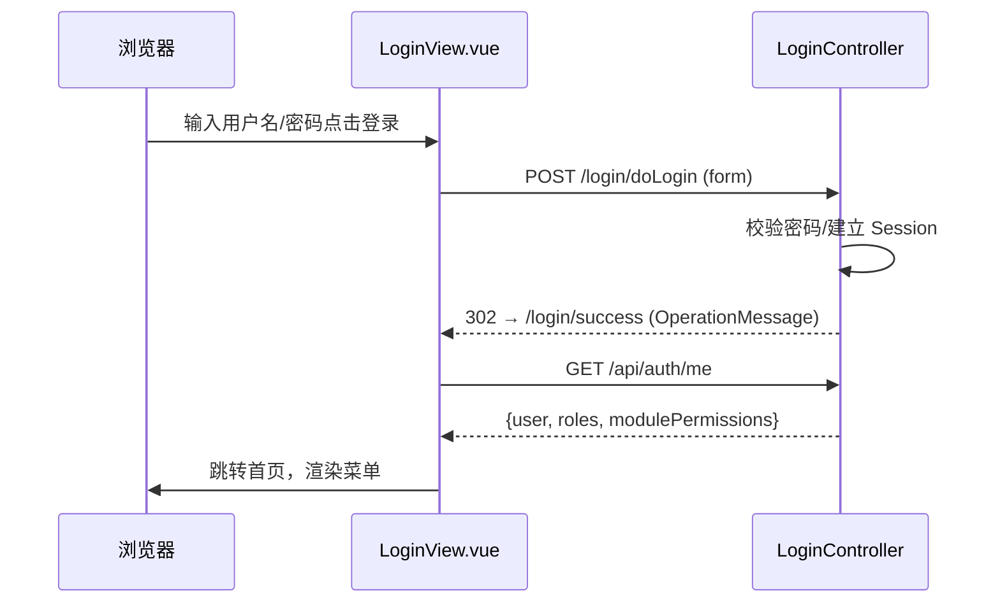

# DataGear 前后端请求响应流程说明

> 本文档按「**页面 → 前端文件 → 前端方法 → 后端 Java 代码 → 请求数据 → 后端处理 → 响应数据 → 前端更新 → 界面展示**」
> 的链路，逐条说明核心交互的信息流。

---

## 0. 通用约定

- 前端统一走 `src/api/request.ts` 的 axios 实例（`withCredentials`，带 `X-Requested-With`）。
- 响应体统一为 `OperationMessage<T>`：`{ type, code, message, data }`；`unwrap()` 解包，`type=FAIL` 抛错并 Toast。
- 后端统一由 `AbstractController` 提供 `optSuccessDataResponseEntity()` 等构造响应。

---

## 1. 登录认证流程

| 环节 | 内容 |
|---|---|
| 页面 | 登录页 |
| 前端文件 | `views/LoginView.vue` |
| 前端方法 | `doLogin(form)`（`api/auth.ts`） |
| 后端代码 | `LoginController#doLogin()`（`/login/doLogin`） |
| 请求数据 | `name/password/checkCode`（表单 urlencoded） |
| 后端处理 | 校验码校验 → 密码匹配 → 建立 Session → 302 |
| 响应数据 | `OperationMessage`（成功含 `data.redirectUrl`） |
| 前端更新 | `stores/auth.ts` 调 `fetchMe()` 拉取当前用户+权限 |
| 界面展示 | 跳转首页，侧菜单按权限渲染 |



---

## 2. 列表分页查询流程（以角色管理为例）

| 环节 | 内容 |
|---|---|
| 页面 | 角色管理列表 |
| 前端文件 | `views/role/RoleListView.vue` |
| 前端方法 | `rolePagingQueryData(query)`（`api/role.ts`） |
| 后端代码 | `RoleApiController#pagingQueryData()`（`/api/role/pagingQueryData`） |
| 请求数据 | `{ page, pageSize, orders, keyword }` |
| 后端处理 | `AbstractEntityApiController` → `roleService.pagingQuery(query)`（MyBatis） |
| 响应数据 | `OperationMessage<PagingData<Role>>`（`{total, items, pages}`） |
| 前端更新 | `items`/`total` ref 更新 |
| 界面展示 | PrimeVue DataTable 懒加载分页渲染 |

---

## 3. 新增/编辑实体流程（以数据源为例）

| 环节 | 内容 |
|---|---|
| 页面 | 数据源表单 |
| 前端文件 | `views/dtbsSource/DtbsSourceFormView.vue` |
| 前端方法 | `saveDtbsSource(entity)`（`api/dtbsSource.ts` → `api/crud.ts` 的 `moduleSave`） |
| 后端代码 | `DtbsSourceApiController`（继承 `AbstractDataPermissionApiController`）`#save()`（`/api/dtbsSource/save`） |
| 请求数据 | `{ title, url, user, password, driverEntity:{id}, ... }` |
| 后端处理 | 按 `id` 判增改 → `persistEntity`（新增自动 `inflateCreateUserAndTime`）→ `dtbsSourceService.add/update(user, entity)` |
| 响应数据 | `OperationMessage<DtbsSource>`（密码已 `clearPassword`） |
| 前端更新 | Toast「保存成功」→ 跳转列表 |
| 界面展示 | 列表刷新显示新数据源 |

---

## 4. 图表预览流程（ECharts 脱离 iframe）

| 环节 | 内容 |
|---|---|
| 页面 | 图表设计器预览区 |
| 前端文件 | `components/chart/ChartPreview.vue`（`views/chart/ChartDesignerView.vue` 引用） |
| 前端方法 | `previewChart(id)`（`api/chart.ts`） |
| 后端代码 | `ChartApiController#preview()`（`/api/chart/preview/{id}`） |
| 请求数据 | 无（路径参数 chart id） |
| 后端处理 | `htmlChartWidgetEntityService.getChartWidget(id)` → `widget.getResult(new ChartQuery())` → 取列（`DataSetBind.getDataSet().getFields()`）+ 行（`DataSetResult.getData()`）+ 字段标记 |
| 响应数据 | `OperationMessage<{pluginId, columns, rows, dataSetSigns, fieldSigns}>` |
| 前端更新 | `ChartPreview.buildOption()` 按插件类型+fieldSigns 生成 ECharts option |
| 界面展示 | `echarts.init().setOption()` 渲染柱状/折线/饼图等 |

---

## 5. 看板设计器流程（图表挂件编辑）

| 环节 | 内容 |
|---|---|
| 页面 | 看板设计器画布 |
| 前端文件 | `views/dashboard/DashboardDesignerView.vue` |
| 前端方法 | `getDashboard/getDashboardResourceContent/saveDashboardResourceContent/reorderChartWidgets`（`api/dashboard.ts`） |
| 后端代码 | `DashboardApiController#get()`（`/api/dashboard/get/{id}`）+ 旧 `DashboardController#getResourceContent/saveResourceContent` |
| 请求数据 | 加载：dashboard id；保存：`{id, resourceName, resourceContent}` |
| 后端处理 | 读/写看板模板资源（index.html），解析/重建 `dg-chart-widget` 挂件 |
| 响应数据 | `OperationMessage<DashboardEntity>` / 资源内容 |
| 前端更新 | 解析挂件列表 `widgets`，每个挂件用 `ChartPreview` 渲染 |
| 界面展示 | 网格布局展示各图表卡片（ECharts），拖拽重排后保存 |

---

## 6. 数据管理流程（表数据 CRUD）

| 环节 | 内容 |
|---|---|
| 页面 | 数据管理页 |
| 前端文件 | `views/dtbsSourceData/DtbsSourceDataView.vue` |
| 前端方法 | `listTables/getTable/pagingQueryData/saveRow/updateRow/deleteRows`（`api/dtbsSourceData.ts`） |
| 后端代码 | `DtbsSourceController`（表列表/表结构）+ `DtbsSourceDataController`（数据增删改查） |
| 请求数据 | 浏览：`{page, pageSize}`；新增：行数据 Map；编辑：`{originalData, data}`；删除：行数组 |
| 后端处理 | `persistenceManager.pagingQuery/get/insert/update/delete`（连接目标数据源） |
| 响应数据 | 裸 `PagingData<Row>` / `OperationMessage<Row>` |
| 前端更新 | 动态列 `table.columns` 渲染表格；增删改后 `loadData()` 刷新 |
| 界面展示 | 动态列表格分页展示，表单按列渲染输入框 |

---

## 7. SQL 工作台流程

| 环节 | 内容 |
|---|---|
| 页面 | SQL 工作台 |
| 前端文件 | `views/sqlpad/SqlpadEditor.vue` |
| 前端方法 | `executeSql/pollMessages/selectData`（`api/sqlpad.ts`） |
| 后端代码 | `DtbsSourceSqlpadController#execute/command/message/select` |
| 请求数据 | `{sqlpadId, sql}` / `{sqlpadId, messageCount}` |
| 后端处理 | 后台线程执行 SQL，消息入队 |
| 响应数据 | `OperationMessage` 消息列表（Start/SqlSuccess/Exception/Finish） |
| 前端更新 | 轮询消息 → 分类渲染日志 → 提取结果集 |
| 界面展示 | 结果 DataTable 分页 +「加载更多」 |

---

## 8. 资源授权流程

| 环节 | 内容 |
|---|---|
| 页面 | 资源授权页 |
| 前端文件 | `views/authorization/AuthorizationView.vue` |
| 前端方法 | `getAuthorizationMeta/listAuthorizations/saveAuthorization/deleteAuthorizations`（`api/authorization.ts`） |
| 后端代码 | `AuthorizationApiController#meta/list/save/delete`（`/api/authorization/{type}/{resource}/...`） |
| 请求数据 | 元数据：无；保存：`{principal, principalType, permission, enabled}` |
| 后端处理 | `authorizationService.isAllowAuthorization` 校验 → `AuthorizationQueryContext` 过滤 → `add/update/delete` |
| 响应数据 | `OperationMessage<Authorization>` / 权限选项列表 |
| 前端更新 | 刷新授权列表 |
| 界面展示 | 授权表格 + 主体（用户/角色/所有/匿名）× 权限下拉 |

---

## 9. 信息流总结

所有请求遵循同一信息流：

```
页面(views/*.vue) 组件(components/*.vue)
        │  调用 api/*.ts 的方法
        ▼
api/*.ts  (request.ts axios 实例，带 Cookie + X-Requested-With)
        │  HTTP 请求 /api/** 或旧 /xxx（JSON）
        ▼
Controller (AbstractController 子类)
        │  鉴权(Security) → 业务 Service
        ▼
Service (management/persistence/analysis/connection)
        │  MyBatis / JDBC / 文件系统
        ▼
数据库/文件/外部数据源
        │
        │  返回实体/PagingData/消息
        ▼
Controller 构造 OperationMessage<T> (JSON)
        │  HTTP 响应
        ▼
api/*.ts unwrap() 解包 → 组件 ref 更新 → 界面渲染
```
